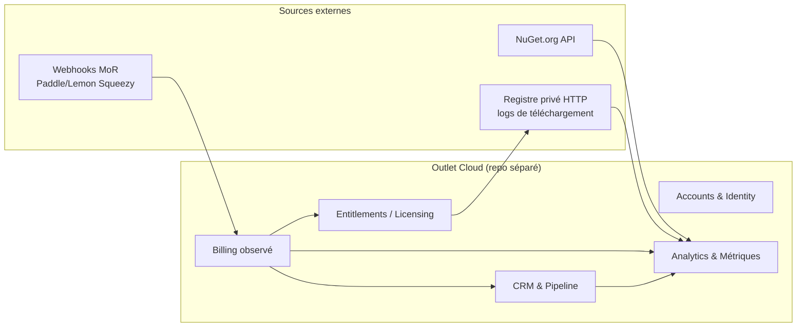

# Outlet Pro — Cadrage CRM / Billing / Analytics

> **Statut** : document de cadrage (design), pas d'implémentation. À challenger avant tout code.
> **Périmètre** : volet « pro » d'Outlet — registres privés payants + CRM éditeur + métriques business.
> **Avertissement** : les passages réglementaires (facture électronique, RGPD, TVA) **ne sont pas un conseil juridique**. La réforme française a beaucoup bougé en 2024-2025 ; à reconfirmer avec un expert-comptable / juriste avant toute mise en prod.

---

## 1. Objectif

Deux faces d'un même produit :

1. **Côté client pro** : proposer des **registres privés** (manifeste + fichiers servis en HTTP, déjà conçus multi-sources dans Outlet) à des entreprises / indépendants via un **compte professionnel payant** (abonnement).
2. **Côté éditeur (toi)** : un **CRM classique** de tes clients/prospects pro, et le suivi de **métriques business** — au minimum :
   - **nombre de téléchargements** (la CLI publique sur NuGet.org **+** les items servis par les registres privés) ;
   - **MRR** (Monthly Recurring Revenue) et dérivés (ARR, churn, ARPA) ;
   - **suivi prospects** (pipeline commercial : prospect → essai → client → expansion/churn).

---

## 2. Décisions de cette session

| Sujet | Décision |
|---|---|
| Livrable | Ce document de cadrage. |
| Cible commerciale | **B2B France + indépendants/B2C + international** (charge de conformité maximale). |
| Emplacement | **Repo séparé** (recommandation, §4). |
| Encaissement / facturation | **Merchant of Record** (recommandation, §5). |

---

## 3. Frontière avec le produit Outlet (non négociable)

Outlet (la CLI + le registre copier-coller) a un **principe verrouillé** : *aucune dépendance runtime à Outlet ; désinstaller Outlet ne casse rien chez l'utilisateur* (CLAUDE.md, principe 1 ; discipline de scope, principe 8 : « cible v1 = email uniquement »).

Le volet pro est un **SaaS hébergé** : CRM, base de données clients, webhooks de paiement, jobs de fond, API d'autorisation. C'est **l'exact opposé** du modèle « code qu'on s'approprie ».

> **Conséquence : ces deux mondes ne doivent pas se mélanger dans le même artefact.** Le SaaS *consomme* le registre (il sert/contrôle l'accès aux registres privés) et *observe* les téléchargements, mais il ne doit jamais introduire de dépendance runtime dans le code des items, ni polluer la discipline de scope « email-only » du v1.

---

## 4. Recommandation — Emplacement : **repo séparé**

**Recommandé : un repo distinct** (ex. `outlet-cloud` ou `outlet-pro`).

Pourquoi :

- **Cycles de vie opposés.** Le registre = code statique versionné, copié par l'utilisateur. Le SaaS = service déployé en continu, migrations DB, secrets, webhooks. Les mélanger pollue la CI, les permissions et le modèle mental.
- **Argument commercial d'Outlet = « zéro dépendance ».** Garder le SaaS dehors protège ce discours : un auditeur du repo Outlet ne doit jamais y trouver de Stripe/EF Core/PII.
- **Surface de sécurité.** Le SaaS manipule des **données personnelles** (RGPD) et des **secrets de paiement**. Il doit avoir son propre périmètre d'accès, sa propre revue, son propre threat model.
- **Réutilisation propre, sans couplage.** `Outlet.Kernel.Shared` (building blocks DDD + Mediator + Result) est un excellent socle commun. Deux options :
  - le **publier en package NuGet interne** consommé par les deux repos (préféré à terme) ;
  - le **vendoring** (copie portée, comme déjà fait pour les libs front depuis WOW) au démarrage.

**Ce qui reste dans le repo Outlet** : uniquement les **points d'extension** du registre nécessaires aux registres privés (auth = post-v1 d'après la roadmap), traités comme une feature normale du registre, sans logique business SaaS.

> Ce document vit volontairement dans `docs/pro/` du repo Outlet en tant qu'**artefact de planification** ; l'implémentation, elle, partira dans le repo séparé.

---

## 5. Recommandation — Encaissement & conformité : **Merchant of Record**

Avec une cible **B2B FR + B2C + international**, tu cumules :

- **TVA multi-juridictions** (B2C UE = TVA du pays de l'acheteur / OSS ; hors UE = règles locales, parfois sales tax US par État) ;
- **facture électronique B2B France** (réforme, §6) ;
- **e-reporting** pour le B2C et l'international.

Porter tout ça toi-même = un projet de conformité à part entière. D'où la recommandation.

### MoR vs PSP direct

| | **Merchant of Record** (Paddle, Lemon Squeezy…) | **PSP direct** (Stripe) |
|---|---|---|
| Qui est le vendeur juridique ? | **La plateforme** | **Toi** |
| TVA / sales tax | Gérée par la plateforme | À ta charge (OSS, seuils, taux…) |
| Émission des factures | Par la plateforme | **À toi** |
| Facture électronique FR (PDP, 2027) | Largement absorbée par le MoR | **À brancher toi-même** |
| Effort de conformité | Faible | Élevé |
| Contrôle / coût | Moins de contrôle, commission plus élevée | Plus de contrôle, commission plus faible |

**Recommandation : démarrer en MoR**, et **réévaluer un passage Stripe + PDP** plus tard si le volume justifie l'internalisation. Le CRM/analytics est conçu pour être **agnostique du provider** (port `IBillingProvider`, §8) afin que ce basculement reste une décision d'infra, pas une réécriture.

### Réforme facture électronique FR — l'essentiel (à reconfirmer)

- Couvre le **B2B domestique** (e-invoicing) ; le **B2C** et l'**international** relèvent de l'**e-reporting**.
- Le **PPF n'assure plus l'échange gratuit** des factures (révision fin 2024) → il faut passer par une **PDP immatriculée** pour émettre/recevoir.
- Calendrier (loi de finances 2024) : **réception** obligatoire pour toutes les entreprises au **1ᵉʳ sept. 2026** ; **émission** pour PME/microentreprises au **1ᵉʳ sept. 2027**.
- Formats socle : **Factur-X**, UBL 2.1, CII.
- **En MoR** : la plateforme émet la facture en son nom → l'obligation PDP « émission » te concerne beaucoup moins. **Mais** la qualification exacte (qui émet quoi, e-reporting résiduel) **doit être validée juridiquement** selon le montage retenu.

---

## 6. Architecture cible — bounded contexts

Le SaaS se découpe en contextes alignés sur l'esprit hexagonal + DDD du repo Outlet (agrégats sealed, factory `Create`, VOs `From(...)`, ports acceptant des VOs, use cases `Result<T>`).

| Contexte | Responsabilité | Agrégats clés |
|---|---|---|
| **Accounts & Identity** | comptes pro, organisations, membres, clés d'API/registre | `Organization`, `Account`, `ApiKey` |
| **Entitlements / Licensing** | « cet abonnement donne-t-il accès à ce registre privé ? » | `Entitlement`, `RegistryAccessGrant` |
| **Billing (observé)** | reflet local des abonnements/paiements venus du MoR (source de vérité = MoR) | `Subscription`, `Invoice` (read-model), `BillingEvent` |
| **CRM & Pipeline** | clients, prospects, étapes commerciales, interactions | `Customer`, `Prospect`, `Deal`, `Interaction` |
| **Analytics** | séries temporelles & KPI (downloads, MRR, churn…) | `MetricSnapshot`, `DownloadCount`, `MrrSnapshot` |

> **Billing = contexte d'observation**, pas d'autorité. La source de vérité financière reste le MoR ; on ingère ses webhooks et on en dérive nos read-models et KPI. Ça évite de réimplémenter de la logique de facturation (et la conformité qui va avec).

---

## 7. Modèle de domaine (esquisse, conventions Outlet)

Toutes les classes suivent les règles d'archi du repo : agrégats `sealed`, **ctor privé + factory statique `Create`** retournant `Result<T>`, **VOs** `sealed` avec `From(...)` validant, **IDs fortement typés**, **synchrone** dans le domaine, **pas de `DateTime.UtcNow`** → `ICurrentDateTimeProvider`, ports acceptant des **VOs** (Tell, Don't Ask), use cases `{Action}{Entity}UseCase : IUseCase<TCommand, TResult>`.

### CRM
- `Customer` (agrégat) : `CustomerId`, `OrganizationId`, `CompanyName`, `BillingEmail (EmailAddress VO)`, `LifecycleStage` (`Prospect|Trial|Active|Churned`), réf. abonnement **par ID**.
- `Prospect` (agrégat) : `ProspectId`, source, `Stage` (pipeline), `Interaction[]` (notes/contacts horodatés via le provider de date injecté).
- `Deal` : montant attendu (`Money` VO), probabilité, étape.
- VOs : `EmailAddress`, `Money` (montant + `Currency`), `CompanyName`, `Mrr`.
- Events : `ProspectConverted`, `CustomerChurned`, `SubscriptionStarted`.

### Entitlements
- `Entitlement` : lie `OrganizationId` ↔ `RegistryAccessGrant` (quels registres privés, quel plan, quelles limites de débit/seats).
- Use cases : `GrantRegistryAccessUseCase`, `RevokeRegistryAccessUseCase`, `CheckEntitlementUseCase` (appelé par l'endpoint qui sert le registre privé).

### Analytics
- `DownloadCount` : `{ source (NuGet|PrivateRegistry), packageOrItemId, day, total, deltaDay }`.
- `MrrSnapshot` : `{ day, mrr (Money), activeSubscriptions, newMrr, expansionMrr, churnedMrr }`.
- Définitions explicites des KPI (à figer pour éviter les débats plus tard) :
  - **MRR** = somme normalisée mensuelle des abonnements actifs (annuel ÷ 12).
  - **ARR** = MRR × 12. **ARPA** = MRR ÷ comptes actifs.
  - **Churn (rev.)** = MRR perdu sur la période ÷ MRR de début de période.
  - **Conversion** = prospects passés `Trial→Active` ÷ prospects entrés.

---

## 8. Ports (Application) & adapters (Infrastructure)

Dans l'esprit Outlet : le **contrat** (port) a zéro dépendance externe ; l'**adapter** porte la lib provider.

| Port | Rôle | Adapter(s) Infra |
|---|---|---|
| `IBillingProvider` | abonnements, MRR brut, webhooks | `PaddleBillingProvider` / (futur) `StripeBillingProvider` |
| `IDownloadStatsSource` | totaux/deltas de téléchargement | `NuGetOrgDownloadSource`, `PrivateRegistryLogDownloadSource` |
| `ICustomerRepository`, `IProspectRepository` | persistance CRM | `EfCore*Repository` (le port `IUnitOfWork` existe déjà dans le Kernel) |
| `IInvoicingGateway` *(si un jour PSP direct)* | émission facture conforme / PDP | adapter PDP immatriculée (post-MoR) |

L'agnosticisme `IBillingProvider` est **ce qui rend le basculement MoR→Stripe réversible** sans toucher au domaine.

---

## 9. Sources de données — précisions (point sensible : downloads)

### Téléchargements de la CLI publique (NuGet.org)
- API : Search Service NuGet v3 (`packageid:<id>` → `totalDownloads`) et/ou registration index.
- **Limite connue** : les compteurs NuGet.org sont **agrégés et différés** (pas de granularité journalière fiable, latence de plusieurs jours, pas d'« uniques »). Conséquence : on **poll quotidiennement et on stocke le delta** nous-mêmes pour reconstruire une série temporelle — on ne peut pas compter sur NuGet pour l'historique fin.

### Téléchargements des registres privés (LE vrai signal par client)
- Ici **on possède le serveur HTTP** qui sert les items → on **instrumente nos propres logs** : par organisation, par item, horodaté, déduplicable. C'est la donnée la plus exploitable (usage réel par client payant, base d'upsell).

### MRR / abonnements
- Dérivé des **webhooks du MoR** (`subscription.created/updated/canceled`, `payment.succeeded`…), ingérés dans le contexte Billing, puis projetés en `MrrSnapshot`.

### Prospects
- Saisie manuelle + import CSV au départ ; enrichissement/automation = plus tard.

---

## 10. Stack technique proposée

- **.NET 10 / C# 14**, mêmes conventions que Outlet (hexagonal, Mediator, `Result`, collection expressions, primary constructors hors Domain, CPM).
- **Réutiliser `Outlet.Kernel.Shared`** (package interne ou vendoring) pour ne pas réinventer agrégats/VO/Result/Mediator.
- **Persistance** : EF Core (PostgreSQL) — le port `IUnitOfWork` abstrait existe déjà au Kernel ; Outbox/UoW « à porter de WOW quand une vraie persistance apparaît » (CLAUDE.md) → **c'est ce moment-là**.
- **Ingestion webhooks** + **jobs planifiés** (poll NuGet quotidien, calcul MRR) via un worker.
- **Tests** : mêmes barres que Outlet — fakes écrits main (zéro framework de mock), frontière HTTP mockée (WireMock/`HttpMessageHandler`), tests d'archi qui verrouillent les conventions, lane PR hermétique sans secret.

---

## 11. Conformité & sécurité

- **RGPD** : clients **et prospects** = données personnelles. Prévoir base légale, **registre des traitements**, durées de conservation, droit à l'effacement, **DPA** avec le MoR et tout sous-traitant (hébergeur, analytics). Minimiser : ne stocker côté CRM que ce qui est utile.
- **Secrets de paiement / clés** : jamais en clair, rotation, périmètre d'accès dédié (autre raison du repo séparé).
- **Facture électronique** : en MoR, l'émission est largement portée par la plateforme ; **valider juridiquement** l'e-reporting résiduel et la qualification du montage.
- **Sécurité de l'accès aux registres privés** : `CheckEntitlementUseCase` sur le chemin chaud, clés révocables, rate-limiting par organisation.

---

## 12. Découpage en incréments (PRs petites, idempotentes — workflow Outlet)

1. **Bootstrap repo séparé** + socle Kernel partagé (package ou vendoring) + CI hermétique + tests d'archi.
2. **Contexte Accounts** : `Organization`/`Account`/`ApiKey` + persistance + use cases.
3. **Entitlements** + endpoint `CheckEntitlement` (chemin chaud du registre privé).
4. **Billing (ingestion MoR)** : webhooks → `Subscription`/`BillingEvent` read-models.
5. **Analytics — downloads** : adapter NuGet + poll quotidien + delta ; instrumentation logs registre privé.
6. **Analytics — MRR** : projection `MrrSnapshot` + KPI dérivés.
7. **CRM & Pipeline** : `Customer`/`Prospect`/`Deal`/`Interaction` + vues pipeline.
8. **Dashboard éditeur** (lecture seule) agrégeant downloads + MRR + pipeline.

Chaque incrément : mergeable seul, code compilé + testé, manifeste/conventions respectés.

---

## 13. Questions ouvertes / à trancher ensuite

- **MoR précis** : Paddle vs Lemon Squeezy vs autre (couverture pays, support B2B FR, qualité webhooks).
- **Modèle de pricing** des registres privés (par seat ? par organisation ? par registre ? quotas de téléchargement ?) — impacte directement le modèle d'`Entitlement`.
- **Kernel partagé** : package NuGet interne dès le départ, ou vendoring puis extraction ?
- **Hébergement / région des données** (RGPD : UE de préférence).
- **Validation juridique** facture électronique + e-reporting selon le montage MoR.

---

## 14. Hors scope (volontairement différé)

- Portail self-service client (signup/billing UI) — après le socle CRM/analytics côté éditeur.
- Automations marketing / scoring de prospects.
- Internalisation Stripe + PDP (réévaluée selon volume).
- Auth des registres privés côté Outlet : reste une feature **du registre** (roadmap « auth = post-v1 »), pas du SaaS.
